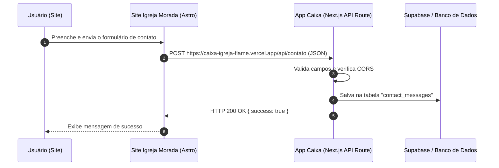

# Guia de Integração: Formulário do Site → App Caixa Igreja

Este guia detalha o passo a passo necessário para receber no aplicativo **Caixa Igreja** (`caixa-igreja-flame.vercel.app`) as mensagens enviadas através do formulário de contato do site **Igreja Morada**.

---

## 1. Visão Geral da Arquitetura



---

## 2. Payload Enviado pelo Site

O formulário do site envia uma requisição HTTP `POST` com `Content-Type: application/json` contendo o seguinte formato:

```json
{
  "firstName": "João",
  "lastName": "Silva",
  "email": "joao@email.com",
  "message": "Gostaria de obter mais informações sobre os cultos de domingo.",
  "sentAt": "2026-07-25T21:50:00.000Z"
}
```

---

## 3. Passos para Implementar no App (`caixa-igreja`)

Quando for iniciar as alterações no projeto `caixa-igreja` (`/home/marcos/Documentos/caixa-igreja`), siga as etapas abaixo:

### Passo A: Criar a Tabela no Supabase (se ainda não existir)

Execute o comando SQL abaixo no console SQL do Supabase do projeto:

```sql
CREATE TABLE IF NOT EXISTS contact_messages (
  id UUID DEFAULT gen_random_uuid() PRIMARY KEY,
  first_name TEXT NOT NULL,
  last_name TEXT NOT NULL,
  email TEXT NOT NULL,
  message TEXT NOT NULL,
  status TEXT DEFAULT 'unread', -- unread, read, archived
  created_at TIMESTAMPTZ DEFAULT NOW()
);

-- Permissões (opcional se usar Service Role Key no Server Action / API route)
ALTER TABLE contact_messages ENABLE ROW LEVEL SECURITY;

-- Exemplo de política para permitir inserção pública (anon):
CREATE POLICY "Permitir insercao anonima de mensagens" 
ON contact_messages 
FOR INSERT 
WITH CHECK (true);
```

---

### Passo B: Criar a API Route no Next.js App Router

No repositório `caixa-igreja`, crie o arquivo `src/app/api/contato/route.ts`:

```typescript
import { NextResponse } from 'next/server';
import { createClient } from '@supabase/supabase-js';

// Inicializa o cliente Supabase do servidor
const supabaseUrl = process.env.NEXT_PUBLIC_SUPABASE_URL!;
const supabaseAnonKey = process.env.NEXT_PUBLIC_SUPABASE_ANON_KEY!;
const supabase = createClient(supabaseUrl, supabaseAnonKey);

export async function OPTIONS() {
  // Resposta para pré-flight request de CORS do navegador
  return new NextResponse(null, {
    status: 200,
    headers: {
      'Access-Control-Allow-Origin': '*', // Ou especifique: 'https://igrejamorada.org'
      'Access-Control-Allow-Methods': 'POST, OPTIONS',
      'Access-Control-Allow-Headers': 'Content-Type',
    },
  });
}

export async function POST(request: Request) {
  try {
    const body = await request.json();
    const { firstName, lastName, email, message } = body;

    // Validação simples dos campos obrigatórios
    if (!firstName || !email || !message) {
      return NextResponse.json(
        { error: 'Campos obrigatórios ausentes.' },
        {
          status: 400,
          headers: {
            'Access-Control-Allow-Origin': '*',
          },
        }
      );
    }

    // Inserção no Supabase
    const { error } = await supabase.from('contact_messages').insert([
      {
        first_name: firstName,
        last_name: lastName || '',
        email: email,
        message: message,
      },
    ]);

    if (error) {
      console.error('Erro Supabase:', error);
      return NextResponse.json(
        { error: 'Erro ao salvar mensagem.' },
        {
          status: 500,
          headers: {
            'Access-Control-Allow-Origin': '*',
          },
        }
      );
    }

    return NextResponse.json(
      { success: true, message: 'Mensagem recebida com sucesso!' },
      {
        status: 200,
        headers: {
          'Access-Control-Allow-Origin': '*',
        },
      }
    );
  } catch (err) {
    console.error('Erro na API:', err);
    return NextResponse.json(
      { error: 'Erro interno do servidor.' },
      {
        status: 500,
        headers: {
          'Access-Control-Allow-Origin': '*',
        },
      }
    );
  }
}
```

---

## 4. Resposta a Dúvidas Frequentes

### Dúvida: *"Você consegue acessar outro diretório, ou devo abrir aqui a pasta?"*
> **Resposta**: Consigo ler, modificar e executar comandos em qualquer diretório do seu sistema (incluindo `/home/marcos/Documentos/caixa-igreja`). Não é estritamente necessário abrir a pasta em outra janela. Porém, para focar o trabalho e testar o dev server do Next.js de forma organizada, abrir a pasta do `caixa-igreja` quando formos trabalhar nele é uma excelente prática.
